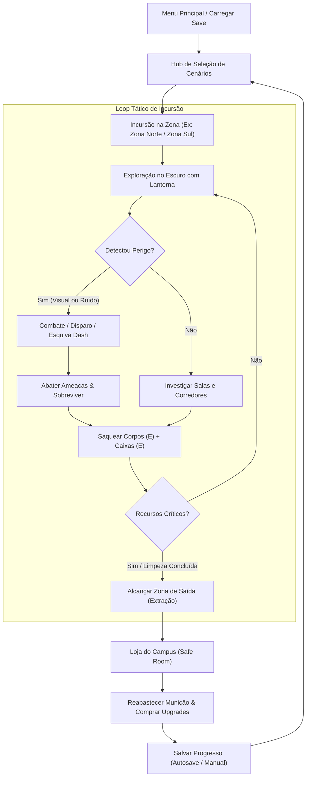
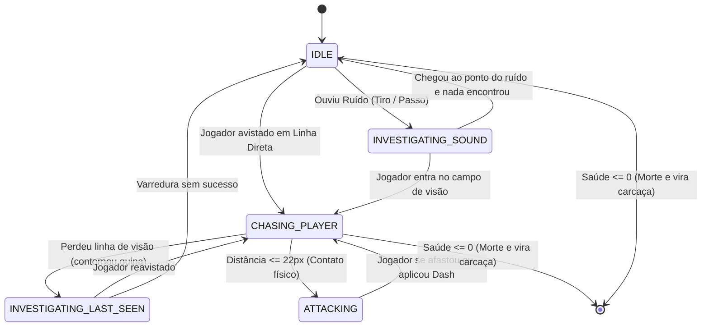

# 🏫 Game Design Document (GDD) — Faculândia

> **Documento de Game Design (GDD Final)**  
> **Disciplina:** Projeto de Jogos Digitais (PJD) — Bacharelado em Ciência da Computação  
> **Instituição:** Universidade Federal do Agreste de Pernambuco (UFAPE)  
> **Docente:** Prof. Rodrigo G. C. Rocha  
> **Repositório Oficial:** [ClaudersonXavier/faculandia](https://github.com/ClaudersonXavier/faculandia)  
> **Versão do Documento:** 1.0 (Versão Final de Entrega)  
> **Data:** Setembro de 2026  

---

## 👥 Autoria e Identificação

| Integrante | Matrícula / E-mail | GitHub |
| :--- | :--- | :--- |
| **Aline Fernanda Soares Silva** | `aline.fernanda@ufape.edu.br` | [@alinesors](https://github.com/alinesors) |
| **Clauderson Branco Xavier** | `xavierclauderson98@gmail.com` | [@ClaudersonXavier](https://github.com/ClaudersonXavier) |
| **Fernando Emídio da Silva Neto** | `emidio8000@gmail.com` | [@fernando7492](https://github.com/fernando7492) |
| **Victor Alexandre Saraiva Pimentel** | `victor.saraiva.pimentel@gmail.com` | [@Victor-Saraiva-P](https://github.com/Victor-Saraiva-P) |

---

## 📑 Sumário Executivo

1. [Visão Geral e High Concept](#1-visão-geral-e-high-concept)
2. [Experiência do Jogador e Pilares de Design](#2-experiência-do-jogador-e-pilares-de-design)
3. [Narrativa, Ambientação e Universo](#3-narrativa-ambientação-e-universo)
4. [Regras, Objetivos e Fluxo de Jogo (Core Loop)](#4-regras-objetivos-e-fluxo-de-jogo-core-loop)
5. [Mecânicas de Jogabilidade e Sistemas de Física](#5-mecânicas-de-jogabilidade-e-sistemas-de-física)
6. [Arsenal, Equipamentos e Economia](#6-arsenal-equipamentos-e-economia)
7. [Inimigos, Variantes e Inteligência Artificial](#7-inimigos-variantes-e-inteligência-artificial)
8. [Level Design, Estrutura do Mundo e Persistência](#8-level-design-estrutura-do-mundo-e-persistência)
9. [Interface do Usuário (UI / UX) e HUD](#9-interface-do-usuário-ui--ux-e-hud)
10. [Design de Áudio e Sonoplastia Reativa](#10-design-de-áudio-e-sonoplastia-reativa)
11. [Arquitetura Técnica e Engenharia de Software](#11-arquitetura-técnica-e-engenharia-de-software)
12. [Diferenciais de Mercado e Análise de Referências](#12-diferenciais-de-mercado-e-análise-de-referências)
13. [Histórico de Desenvolvimento e Roadmap](#13-histórico-de-desenvolvimento-e-roadmap)
14. [Glossário e Referências Bibliográficas](#14-glossário-e-referências-bibliográficas)

---

## 1. Visão Geral e High Concept

### 1.1 Identificação Básica
* **Título do Jogo:** Faculândia
* **Gênero:** *Survival Horror* / *Top-Down Shooter* Tático 2D
* **Plataforma Alvo:** Computador Pessoal (PC — Linux e Windows)
* **Motor de Desenvolvimento:** Godot Engine 4.x (GDScript e Shaders customizados em GLSL)
* **Público-Alvo:** Fãs de jogos indie de sobrevivência tática, terror atmosférico, gerenciamento de recursos escassos e jogos de ação tática em perspectiva superior (fãs de títulos como *Darkwood*, *Hotline Miami* e *Project Zomboid*). Faixa etária indicativa: 14+ anos.

### 1.2 High Concept
> **Em um campus universitário abandonado e mergulhado na escuridão após um surto biológico, sobreviva a hordas de criaturas hostis usando um feixe de visão cônica guiado pela lanterna, acústica tática e gerenciamento estrito de recursos.**

### 1.3 Resumo da Premissa
O jogador controla um estudante sobrevivente encurralado nas dependências da universidade. O campus foi tomado por aberrações denominadas **Ameaças**. Para escapar e recompor o controle sobre os setores acadêmicos, o jogador deve se infiltrar em diferentes zonas do campus (como a Zona Norte e a Zona Sul), explorar salas de aula e corredores labirínticos, enfrentar ou desviar de criaturas atraídas por ruídos, saquear moedas de corpos e caixas de suprimentos, e utilizar a **Loja do Campus** (uma sala segura de extração) para comprar armas avançadas (como a Escopeta), adquirir melhorias balísticas e desbloquear equipamentos de sobrevivência (como lanternas aprimoradas e sapatos com corrida/dash).


*Figura 1: Tela Inicial do jogo — Interface de Menu Principal com opções de Novo Jogo, Continuar e Sair.*

---

## 2. Experiência do Jogador e Pilares de Design

```
+-------------------------------------------------------------------------+
|                          PILARES DE DESIGN                              |
+--------------------+--------------------+-------------------------------+
|  1. Assimetria     |  2. Acústica       |  3. Precisão Tática           |
|     Sensorial      |     Reativa        |     e Escassez                |
|  (Visão cônica     |  (Som como         |  (Cada tiro conta;            |
|   e descarte real  |   mecânica ativa   |   gerenciamento estrito       |
|   de geometria)    |   de detecção)     |   de vida e munição)          |
+--------------------+--------------------+-------------------------------+
```

### 2.1 Pilares Fundamentais

1. **Assimetria Sensorial e Claustrofobia Visual**:
   O jogador nunca possui visão onisciente do cenário. O campo de visão é estritamente limitado por um cone de luz frontal simulado por raycasting físico em tempo real e uma percepção periférica rasa ao redor do corpo. Inimigos e objetos nas sombras são completamente ocultados do renderizador através de descarte de fragmentos no shader (`discard`), criando tensão constante ao virar corredores e abrir portas.

2. **Acústica Reativa e Propagação de Som**:
   O som não é apenas estético, mas um componente dinâmico de gameplay. Disparos reverberam por centenas de pixels e atraem grupos inteiros de criaturas; passos descuidados alertam inimigos próximos; impactos de balas em paredes geram estímulos que desviam a atenção das aberrações. O jogador precisa equilibrar o uso de força letal e a cautela sonora.

3. **Precisão Tática e Escassez de Recursos**:
   Munição é finita e custosa. Enfrentar todos os inimigos à queima-roupa é inviável sem planejamento. O combate exige pontaria precisa, controle de recuo, administração de recargas lentas e uso cirúrgico de esquivas através de dash.

4. **Identidade Universitária Autêntica**:
   A ambientação do jogo foge dos clichês de bases militares ou cidades norte-americanas genéricas, ancorando o universo no ambiente palpável de uma instituição pública de ensino superior brasileira (UFAPE) — blocos didáticos, laboratórios, carteiras escolares, caixas de suprimentos acadêmicos e corredores conhecidos transformados em pesadelo.

---

## 3. Narrativa, Ambientação e Universo

### 3.1 O Incidente Acadêmico
Um experimento biológico não autorizado conduzido nos laboratórios centrais do campus resultou em contaminação em massa por um agente patogênico fúngico/neurodegenerativo. O campus foi colocado sob quarentena severa pelo exército, os portões principais foram trancados, o fornecimento de energia elétrica da rede pública foi interrompido e a maioria dos docentes, técnicos e discentes sucumbiu à infecção, transformando-se em carcaças agressivas que respondem apenas a estímulos primitivos de som e movimento.

### 3.2 As Entidades do Mundo

* **O Protagonista (O Estudante Sobrevivente)**:  
  Um aluno que ficou retido nos prédios durante a interdição. Sem treinamento militar formal, depende de agilidade, raciocínio tático, uma lanterna de mão e armas improvisadas ou resgatadas de agentes de segurança para tentar abrir caminho entre os setores do campus.

* **As Ameaças (Infectados / Zumbis)**:  
  Humanos em estágio avançado de mutação biológica.
  * **Ameaça Padrão**: Lenta, porém resistente e letal em ataques de contato corporal contínuo. Move-se a 70 px/s e possui 24 pontos de vida.
  * **Ameaça Rápida**: Variante com perda de massa muscular necrótica, extremamente veloz e errática (110 px/s, 16 pontos de vida), capaz de encurralar o sobrevivente rapidamente se este fizer barulho.

* **O Balcão de Suprimentos (A Loja / Safe Room)**:  
  Um posto avançado de triagem localizado em uma área intermediária protegida do campus. Permite que o sobrevivente respire, reabasteça cartuchos e utilize os recursos financeiros recolhidos dos infectados e dos prédios para aprimorar seu inventário bélico.

---

## 4. Regras, Objetivos e Fluxo de Jogo (Core Loop)

### 4.1 Objetivos do Jogador
* **Objetivo Primário**: Infiltrar-se nos setores do campus, purificar as áreas eliminando focos de infecção e coletar dinheiro para se fortalecer até alcançar as rotas de fuga definitiva.
* **Objetivos Secundários**:
  * Encontrar e arrombar caixas de suprimentos lacradas espalhadas pelas salas (R$ 15,00 cada).
  * Saquear cadáveres de Ameaças abatidas (R$ 5,00 cada).
  * Comprar a Escopeta e maximizar as árvores de upgrades de armas e sobrevivência.
  * Concluir a exploração sem esgotar toda a reserva de saúde e munição.

### 4.2 Condições de Vitória e Derrota
* **Derrota (Morte)**: A vida numérica do jogador (máximo base de 100) chega a 0. O jogo entra em pausa com tela de **Game Over**. O jogador pode reiniciar a partir do último ponto seguro salvo (checkpoint) ou voltar ao Menu Principal. O momento da morte nunca sobrescreve o save com vida zerada (recuperação justa).
* **Sobrevivência / Vitória do Setor**: O jogador atinge a **Zona de Saída** do setor em exploração, extraindo com segurança para a Loja do Campus e preservando todo o dinheiro e itens coletados.

### 4.3 Diagrama do Core Loop




*Figura 2: Hub Central de Seleção de Cenários — Interface que conecta o sobrevivente aos setores acadêmicos disponíveis (Zona Norte e Zona Sul).*

### 4.4 Economia e Decisão de Risco vs. Recompensa
Toda incursão apresenta um dilema fundamental:
* Disparar uma arma facilita a eliminação imediata de uma Ameaça, mas o estrondo (raio de 600px a 900px) alerta outras criaturas em salas adjacentes.
* Avançar correndo economiza tempo, mas os passos geram ondas sonoras a cada 27 pixels andados (raio de 120px).
* Explorar salas secundárias aumenta o ganho financeiro através de caixas de suprimentos (R$ 15,00), mas expõe o jogador a emboscadas no escuro.

---

## 5. Mecânicas de Jogabilidade e Sistemas de Física

### 5.1 Esquema de Controles e Mapeamento

| Ação | Dispositivo / Tecla | Descrição Funcional |
| :--- | :--- | :--- |
| **Movimento Frontal / Lateral** | <kbd>W</kbd>, <kbd>A</kbd>, <kbd>S</kbd>, <kbd>D</kbd> / Setas / Gamepad | Move o jogador em 8 direções. Aceleração de 1200 px/s² e atrito de 1400 px/s². |
| **Recuo Tático (*Backpedal*)** | Andar no sentido oposto à mira do mouse | Aplica penalidade automática de 15% na velocidade base de caminhada. |
| **Mira e Orientação** | `Movimento do Mouse` | Direciona o facho da lanterna, o cone de visão direta e o cano da arma. |
| **Disparar** | `Botão Esquerdo do Mouse` | Efetua disparo com a arma ativa respeitando cadência, munição e dispersão. |
| **Recarregar** | <kbd>R</kbd> | Inicia ciclo de recarga (em lote na pistola ou cartucho por cartucho na escopeta). |
| **Alternar Armas** | <kbd>1</kbd> / <kbd>2</kbd> | Alterna instantaneamente com atraso de transição de 350ms entre Pistola e Escopeta. |
| **Investida Tática (*Dash*)** | <kbd>Shift</kbd> | Arranco direcional de velocidade (380 px/s) com invulnerabilidade total por 0.18s. |
| **Interação / Saque** | <kbd>E</kbd> | Abre caixas de suprimentos e recolhe moedas de infectados abatidos. |
| **Menu de Pausa** | <kbd>ESC</kbd> | Interrompe o fluxo de jogo, permitindo salvar no slot ativo, opções e saída. |
| **Debug de Visão** | <kbd>F1</kbd> | Ativa modo de teste do raycaster, revelando mapa completo sem penumbra. |
| **Debug de IA** | <kbd>F2</kbd> | Renderiza rotas, nós de navegação e raios de percepção dos inimigos. |
| **Debug Acústico** | <kbd>F3</kbd> | Exibe visualizador de círculos de propagação de ruído na cena ativa. |

---

### 5.2 Sistema de Percepção Tática e Raycasting 2D

O sistema de visão do Faculândia foi concebido através de uma arquitetura proprietária baseada em consultas físicas vetoriais (`PhysicsDirectSpaceState2D`):

```
                        [ CURSOR DO MOUSE ]
                                 ^
                                / \
                               /   \   Cone Frontal Direto
                              /     \  (75° a 135°, alcance até 540px)
                             /       \  Bloqueado por paredes e obstáculos
                            /         \
                           /   PLAYER  \
                          +-------------+
                          | (Percepção) |  Círculo Periférico 360°
                          | Periférica  |  (Curto alcance, bloqueado só por paredes)
                          +-------------+
```

1. **Visão Direta Cônica**:
   * Ângulo inicial de **75°**, alcance frontal de **450 pixels** (expansível via upgrades).
   * Projetado a partir da posição do jogador na direção do mouse.
   * Sofre oclusão total por paredes altas (`PhysicsLayers.OBSTACULO`) e por obstáculos baixos como caixas e barris (`PhysicsLayers.OBSTACULO_BAIXO`).
   * Algoritmo otimizado com verificação AABB (*slab method*) e densidade dinâmica de raios para garantir 60 FPS contínuos.

2. **Percepção Periférica (Sexto Sentido)**:
   * Raio circular de 360° em torno do sobrevivente.
   * Permite perceber a aproximação de perigos imediatos pelas costas.
   * Atravessa obstáculos baixos (barris e caixas), mas é bloqueado por paredes de concreto.

3. **Oclusão Real em Nível de Shader**:
   * Diferente de jogos que utilizam apenas luzes aditivas, o Faculândia implementa oclusão real via Shaders GLSL:
     * `visao_conica.gdshader`: Escurece e dessatura a geometria do mapa fora do facho de visão.
     * `fragmento_perceptivel.gdshader`: Executa o descarte de fragmentos (`discard`) em tempo real sobre qualquer sprite de entidade (inimigos, caixas, itens) fora do polígono de visibilidade, impedindo qualquer "vazamento" de silhueta.

| Exploração e Visão Tática | Combate e Sobrevivência |
| :---: | :---: |
|  |  |
| *Figura 3: Feixe de visão frontal cônica e percepção periférica geradas por raycasting físico.* | *Figura 4: Engajamento balístico contra Ameaças no escuro com gerenciamento de saúde crítica.* |

---

### 5.3 Sistema Acústico Reativo (*Noise Bus*)

O jogo implementa um barramento desacoplado de eventos sonoros (`noise_bus.gd`). Qualquer entidade pode emitir uma perturbação acústica registrada com coordenadas espaciais, tipo, raio de alcance e decaimento:

```
[ AÇÃO DO JOGADOR ] ---> [ NOISE BUS ] ---> [ IA DAS AMEAÇAS ]
 Passos (120px)           Registra evento    Calcula distância e
 Impacto de Bala (250px)  e distribui        atenuação -> Inicia
 Disparo de Arma (600-900px)                 investigação acústica
```

* **Passos do Jogador**: Emitidos a cada 27 pixels percorridos. Raio de **120 pixels**.
* **Impacto Balístico**: O choque do projétil contra uma parede ou barril emite ruído de **250 pixels**, permitindo disparos de distração tática.
* **Tiro de Pistola**: Estrondo severo com raio de **600 pixels**.
* **Tiro de Escopeta**: Detonação potente com raio de **900 pixels**, alertando praticamente o setor inteiro.
* **Grunhidos das Criaturas**: Sons periódicos (intervalo entre 4s e 9s, raio de 500px) que auxiliam o jogador a localizar ameaças no escuro antes do contato visual.

---

### 5.4 Sistema de Combate, Dano e Balística

* **Projéteis Físicos**: As balas não utilizam *hitscan* instantâneo; são atores físicos que viajam no espaço com velocidade e tamanho de colisão definidos, respeitando barreiras e quinas do cenário.
* **Variação de Dano e Disparos Críticos**:
  * Tiros calculam dano pseudo-aleatório em intervalo fechado `[min, max]`.
  * Possuem chance percentual de acerto crítico (`crit_chance`), aplicando multiplicador de **2.0x** no dano e provocando recuo severo.
* **Recuo e Força de Impacto (*Knockback*)**: A Escopeta aplica impulso físico de afastamento nas criaturas atingidas (120 px/s), interrompendo botes iminentes.
* **Saúde e Invulnerabilidade do Jogador**:
  * Vida numérica padrão de 100 pontos.
  * Ao receber dano, o jogador recebe um *hit flash* avermelhado e ganha **0.2 segundos de invulnerabilidade temporal** (*i-frames*), impedindo mortes instantâneas causadas por múltiplos golpes no mesmo frame.

---

## 6. Arsenal, Equipamentos e Economia

### 6.1 Catálogo de Armamentos

```
===========================================================================
                                ARSENAL
===========================================================================
  PISTOLA DE SERVIÇO (Arma Inicial)
  - Cadência: 0.4s entre disparos | Velocidade do Projétil: 600 px/s
  - Ruído: 600 px | Recarga em bloco: 0.8s | Reabastecimento na Loja: Grátis
---------------------------------------------------------------------------
  ESCOPETA CALIBRE 12 (Aquisição na Loja por R$ 50,00)
  - Cadência: 0.8s entre tiros | Bagos por disparo: 6 projéteis
  - Dispersão: 38° de cone | Força de Knockback: 120 px/s
  - Ruído: 900 px | Recarga: Cartucho por cartucho | Reabastecimento: R$ 10,00
===========================================================================
```


*Figura 5: Loja do Campus — Interface com catálogo de aprimoramentos para armas (Pistola e Escopeta), recarga e aquisição de power-ups.*

---

### 6.2 Tabelas de Upgrades e Progressão Numérica

#### A) Pistola de Serviço
Os upgrades são divididos em 4 trilhas independentes, com 3 níveis de aprimoramento cada. Custos de compra progressivos: **Nível 1 (R$ 15,00)**, **Nível 2 (R$ 20,00)** e **Nível 3 (R$ 25,00)**.

| Trilha | Nível 0 (Base) | Nível 1 | Nível 2 | Nível 3 (Máx) | Descrição do Impacto |
| :--- | :---: | :---: | :---: | :---: | :--- |
| **Dano por Disparo** | 7.0 – 9.0 | 8.0 – 10.0 | 9.0 – 11.0 | 10.0 – 12.0 | Reduz quantidade de tiros necessários para abater Ameaças. |
| **Capacidade do Tambor** | 7 tiros | 8 tiros | 9 tiros | 10 tiros | Permite confrontos mais longos sem interrupção de recarga. |
| **Munição Reserva** | 14 tiros | 21 tiros | 28 tiros | 35 tiros | Maior autonomia em incursões prolongadas nos setores. |
| **Chance de Crítico** | 0% | 10% | 20% | 30% | Potencializa disparos que causam o dobro do dano total. |

#### B) Escopeta Calibre 12
Comprada pelo valor base de **R$ 50,00**. 4 trilhas com progressão de custos: **Nível 1 (R$ 20,00)**, **Nível 2 (R$ 30,00)** e **Nível 3 (R$ 40,00)**.

| Trilha | Nível 0 (Base) | Nível 1 | Nível 2 | Nível 3 (Máx) | Descrição do Impacto |
| :--- | :---: | :---: | :---: | :---: | :--- |
| **Dano por Bago** | 3.0 – 5.0 | 4.0 – 6.0 | 5.0 – 7.0 | 6.0 – 8.0 | Com 6 bagos, o dano máximo à queima-roupa atinge 48 pts. |
| **Capacidade do Tubo** | 2 cartuchos | 3 cartuchos | 4 cartuchos | 5 cartuchos | Aumenta capacidade de disparos pesados em sequência. |
| **Reserva de Cartuchos** | 4 cartuchos | 6 cartuchos | 8 cartuchos | 10 cartuchos | Permite carregar mais munições pesadas de reserva. |
| **Tempo de Recarga** | 0.75s / cartucho | 0.60s / cartucho | 0.48s / cartucho | 0.38s / cartucho | Acelera a inserção individual de cartuchos no tubo. |

---

### 6.3 Power-ups e Consumíveis de Sobrevivência

| Item / Power-up | Custo (R$) | Níveis | Efeito Mecânico |
| :--- | :---: | :---: | :--- |
| **Facho da Lanterna** | R$ 20 / 30 / 40 | 3 Níveis | Expande o ângulo de visão de 75° para **95°**, **115°** e **135°**, e o alcance de 450px para **480px**, **510px** e **540px**. Reduz pontos cegos. |
| **Sapatos de Corrida** | R$ 30 / 40 | 2 Níveis | Desbloqueia a manobra de **Dash** (<kbd>Shift</kbd>). Nível 1: recarga em 10.0s. Nível 2: recarga acelerada para 5.0s. |
| **Kit Médico / Curativos** | R$ 15,00 | Consumível | Restaura imediatamente a saúde do jogador para o valor máximo (100 pts) na loja. |
| **Boletim Informativo** | R$ 25,00 | Permanente | Habilita telemetria avançada no HUD, exibindo a contagem numérica exata de Ameaças vivas restantes no setor. |

---

### 6.4 Fontes de Moeda no Cenário

* **Loot de Ameaças Abatidas**: Ao morrer, a carcaça do infectado exibe o indicador interativo `"Aperte 'E' para interagir"`, concedendo **R$ 5,00**.
* **Caixas de Suprimentos Acadêmicos**: Caixas reforçadas espalhadas nas salas de aula concedem **R$ 15,00** ao serem abertas com <kbd>E</kbd> e são marcadas permanentemente como coletadas no save.


*Figura 6: Interação no Cenário — Iluminação direta com a lanterna e abertura de caixa de suprimentos acadêmicos para coleta de recursos (+$15).*

---

## 7. Inimigos, Variantes e Inteligência Artificial

### 7.1 Máquina de Estados Finita da IA (*FSM*)



### 7.2 Comportamentos e Rotinas da IA

1. **Detecção Óptica Adaptativa**:
   As Ameaças possuem campo de visão próprio de **380 pixels**. A cada 0.2s, executam testes físicos via `PhysicsUtils.has_clear_line` contra colisores de paredes e obstáculos. Ao constatar visada direta desobstruída, engajam perseguição imediata.

2. **Navegação em Malha (*NavigationAgent2D*)**:
   Quando a linha de visão é rompida (por exemplo, ao dobrar uma esquina ou se esconder em uma sala), a criatura recorre ao nó `NavigationAgent2D` com malha bakeada em tempo real para contornar quinas de paredes de forma fluida e inteligente.

3. **Separação em Bando (*Flocking / Boids*)**:
   Para evitar agrupamentos sobrepostos antinaturais, as Ameaças aplicam o algoritmo de repulsão de separação (`flocking_utils.gd`) com raio de 60px e peso de repulsão de 0.6. Em ataques conjuntos, a horda cerca o jogador em semicírculo em vez de formar uma linha única.

4. **Detecção e Recuperação de Travamento (*Stuck Check*)**:
   Se a criatura permanecer por 15 quadros consecutivos com deslocamento inferior a 4 pixels enquanto em perseguição, ela recalcula sua rota para evitar ficar presa em móveis ou cantos de portas.

---

### 7.3 Tabela Comparativa de Inimigos

| Atributo / Característica | Ameaça Padrão (`Ameaca`) | Ameaça Rápida (`AmeacaRapida`) |
| :--- | :---: | :---: |
| **Spritesheet Visual** | `ameaca.png` (Uniforme hospitalar/civil) | `zombie2_sheet.png` (Mutante esguio) |
| **Pontos de Vida Máxima** | **24.0 HP** (Suporta ~3 tiros de pistola) | **16.0 HP** (Suporta ~2 tiros de pistola) |
| **Velocidade de Deslocamento** | **70.0 px/s** (Metade da vel. do player) | **110.0 px/s** (Próximo à vel. do player) |
| **Dano de Contato** | **8.0 pts** a cada 1.0s de contato | **4.0 pts** a cada 1.0s de contato |
| **Composição no Cenário** | **75% da população** | **25% da população** |
| **Papel Tático no Jogo** | Força bruta que absorve munição e pressiona recuos. | Batedor veloz que corta rotas e força o uso do Dash. |

---

## 8. Level Design, Estrutura do Mundo e Persistência

### 8.1 Filosofia Arquitetônica dos Níveis
O campus universitário foi construído com base em princípios clássicos de *level design* para *survival horror*:
* **Corredores com Gargalos e Estrangulamentos**: Promovem emboscadas sonoras e forçam o uso de tiros penetrantes ou escopeta.
* **Salas Fechadas com Duas Entradas**: Incentivam manobras de flanqueamento e oferecem rotas de fuga arriscadas.
* **Obstáculos Baixos vs. Altos**: Mesas, barris e caixas baixas permitem que a percepção periférica funcione enquanto bloqueiam a visão direta e a passagem física. Paredes altas bloqueiam completamente a visão, a percepção e o som direto.

---

### 8.2 Topologia das Zonas

```
                       [ MENU PRINCIPAL ]
                               |
                               v
                  [ HUB DE SELEÇÃO DE CENÁRIOS ]
                         /             \
                        v               v
               +----------------+  +----------------+
               |   ZONA NORTE   |  |    ZONA SUL    |
               | Bloco Didático |  | Setor em Obras |
               | Salas de Aula  |  | Pátio Aberto   |
               | População: ~30 |  | População: ~30 |
               +----------------+  +----------------+
                        \               /
                         v             v
                     [ ZONA DE EXTRAÇÃO ]
                               |
                               v
                     [ LOJA / SAFE ROOM ]
                               |
                               v
                  [ RETORNO AO HUB CENTRAL ]
```

1. **Hub Central de Cenários (`selecao_de_cenario.tscn`)**:
   Inspirado na estrutura clássica de seleção de estágios (estilo *Mega Man*), permite ao jogador escolher qual setor explorar.
2. **Zona Norte (`zona_norte.tscn`)**:
   Setor acadêmico completo com salas de aula, corredores, carteiras escolares, caixas de suprimentos e população balanceada de Ameaças.
3. **Zona Sul (`zona_sul.tscn`)**:
   Setor aberto de expansão do campus com obstáculos esparsos, navegação ampla e alta concentração de Ameaças Rápidas.
4. **Loja do Campus (`loja.tscn`)**:
   Área segura desmilitarizada acessada pela Zona de Saída. Possibilita todas as compras e sempre devolve o sobrevivente ao Hub Central para a próxima missão.

---

### 8.3 Geração Procedural Justa e Persistência Viva do Mundo

1. **População Procedural Não-Invasiva (`ZonaPopulador`)**:
   * Na primeira visita a uma zona, gera automaticamente cerca de **30 Ameaças** espalhadas pelo cenário.
   * Utiliza amostragem por rejeição baseada em física (`PhysicsUtils.is_position_clear` e `PhysicsUtils.has_clear_line`): nenhuma Ameaça pode surgir dentro de paredes, perto demais do ponto de entrada do jogador, ou com linha de visão aberta imediata para o spawn.

2. **Snapshot Persistente de Zonas**:
   * O estado de cada entidade na zona é persistido em memória e disco:
     * Ameaças mortas permanecem como carcaças estáticas no exato local da morte.
     * Carcaças já saqueadas e caixas de suprimentos já abertas nunca ressurgem.
     * Inimigos vivos mantêm seu estado de prontidão.
3. **Folga de Segurança ao Reentrar**:
   Ao retornar de uma incursão ou da loja, qualquer Ameaça viva que tenha se deslocado para menos de **400 pixels** da saída é automaticamente reposicionada, impedindo emboscadas injustas no carregamento da tela.

---

## 9. Interface do Usuário (UI / UX) e HUD

```
+-------------------------------------------------------------------------+
| [Ameaça Ícone] 18 Ameaças Restantes (com Boletim)                       |
|                                                                         |
|                                                                         |
|                                + [MIRA MOUSE]                           |
|                                                                         |
|                                                                         |
|                                                                         |
|                                                                         |
| [+] HP [==========|    ] 65/100                                         |
| [Arma: Pistola] [1] Pente: 07/07  |  Reserva: 21                        |
| [R] Recarregar Disponível                                               |
+-------------------------------------------------------------------------+
```

### 9.1 Elementos do HUD em Jogo
1. **Barra de Saúde Numérica Dinâmica** (Canto inferior esquerdo):
   Exibe graficamente e em texto numérico o estado da saúde (`Vida Atual / Vida Máxima`). A barra transiciona de cor dinamicamente:
   * **Verde**: > 60% de HP (Seguro).
   * **Amarelo / Laranja**: 25% a 60% de HP (Alerta).
   * **Vermelho Pulsante**: < 25% de HP (Perigo Crítico).
2. **Painel de Armamento e Munição**:
   Identifica a arma equipada, munição do carregador/tambor atual, estoque total na reserva e aviso intermitente de `"RECARREGANDO..."`.
3. **Telemetria de Ameaças** (Canto superior esquerdo):
   Ícone da Ameaça com indicação qualitativa ("Presença Hostil Detectada") ou contagem numérica exata após a aquisição do Boletim de Inteligência na Loja.
4. **Mira Customizada (*Crosshair*) Desacoplada**:
   Renderizada no espaço de tela do `CanvasLayer`, garantindo que o cursor do mouse permaneça perfeitamente nítido, sem ser obscurecido ou distorcido pelo shader de escuridão da cena.

---

### 9.2 Telas de Menu e Navegação

* **Menu Principal**: Identidade visual do projeto com Novo Jogo, Continuar e Sair.
* **Sistema de Slots de Salvamento**:
  * **4 Slots Independentes**: 1 *Autosave* automático acionado a cada troca de fase/saída da loja + 3 Slots Manuais.
  * Painel de seleção de slots informa data, horário e zona em que o save foi gerado, com confirmação expressa contra sobrescritas acidentais.
* **Menu de Pausa (<kbd>ESC</kbd>)**:
  * Permite salvar o estado exato da partida no slot ativo sem sair do jogo, retomar ou retornar ao menu principal.
* **Tela de Game Over**:
  * Apresenta interface dramática ao zerar a vida, com botões para carregar o último checkpoint salvo ou voltar ao menu, sem corromper o progresso conquistado.


*Figura 7: Painel de Gerenciamento de Saves — Sistema de múltiplos slots com indicação de saldo financeiro, munição, zona atual e data/hora do registro.*

---

## 10. Design de Áudio e Sonoplastia Reativa

### 10.1 Filosofia Sonora: Tensão pelo Silêncio
Diferente de shooters de ação frenética com trilhas orquestradas pesadas, o Faculândia adota uma filosofia de **silêncio tenso** durante as incursões. Dentro dos setores acadêmicos, **não há música de fundo**. O espaço acústico é preenchido exclusivamente pela diegese sonora: o eco dos próprios passos do jogador, o estalo metálico do percussor de recarga, o ruído seco de cartuchos caindo e os grunhidos abafados de infectados rondando salas vizinhas.

### 10.2 Trilha Sonora Não-Diegética (Música Tema)
Uma composição instrumental de suspense atmosférico (`res://scripts/audio/musica_tema.gd`) toca de forma contínua exclusivamente nos espaços de descompressão:
* Tela de Menu Principal
* Hub de Seleção de Cenários
* Loja do Campus (Safe Room)  
Ao entrar em uma zona jogável, a música cessa imediatamente através do `_ready()` do jogador, devolvendo a prioridade à audição tática.

### 10.3 Efeitos Sonoros Híbridos (SFX Reais + Síntese Procedural)
* **Arquivos Reais (.mp3)**: Efeitos de disparo de arma de fogo (`tiro.mp3`), grunhidos de infectados (`zumbi.mp3`) e passos (`passo.mp3`) utilizam gravações reais de alta definição.
* **Loop Inteligente de Passos**: O som de passos toca em loop contínuo gerenciado em código (`player_moviment.gd`), alternando o volume entre -80dB e -22dB sem cortes ríspidos de áudio ou sobreposição destrutiva de múltiplos canais.
* **Síntese Procedural em Código**: Quando um arquivo sonoro específico não está presente na compilação, o sintetizador do jogo (`noise_synthesizer.gd`) calcula curvas matemáticas de onda branca e senoidal para sintetizar o áudio em tempo real, impedindo falhas na execução.

---

## 11. Arquitetura Técnica e Engenharia de Software

### 11.1 Padrões de Projeto Adotados

```
+-------------------------------------------------------------------------+
|                  PADRÕES ARQUITETURAIS DO SISTEMA                       |
+--------------------+--------------------+-------------------------------+
|  1. Singleton /    |  2. Fachadas       |  3. Barramento de             |
|     Autoload       |     Estáticas      |     Eventos (Event Bus)       |
|  - GameState       |  - SaveJogo        |  - NoiseBus                   |
|  - MusicaTema      |  - ZonaPopulador   |    (Comunicação fraca entre   |
|  (Estado global    |  - PhysicsUtils    |     armas, física e IA)       |
|   e áudio contínuo)|  - Upgrades*       |                               |
+--------------------+--------------------+-------------------------------+
```

* **Singleton / Autoloads Controlados**:
  * `GameState`: Único responsável pelo estado volátil e serializável da sessão ativa (dinheiro, inventário, munições, vida, flags).
  * `MusicaTema`: Responsável pelo controle de estado sonoro não-diegético.
* **Fachadas Estáticas (*Static Facades*)**:
  Classes especializadas sem retenção de estado concorrente, contendo lógica pura:
  * `SaveJogo`: Ponto focal único para operações de I/O em disco, transições de fase e aplicação de payloads.
  * `SaveSlots`: Interface de leitura e escrita de arquivos no padrão `ConfigFile` com metadados e controle de versão.
  * `ZonaPopulador`: Algoritmos de distribuição espacial de entidades e gestão de snapshots do mundo.
  * `PhysicsUtils`: Métodos reutilizáveis de teste de linha de visão, intersecção de formas e caminhos desobstruídos.
  * `UpgradesPistola` / `UpgradesShotgun` / `UpgradesPowerups`: Tabelas e validações de compra que blindam o `GameState`.
* **Barramento de Eventos (*Event Bus*)**:
  * `NoiseBus`: Desacopla completamente quem gera som (jogador, armas, balas, passos) de quem consome som (a inteligência artificial das Ameaças).

---

### 11.2 Pipeline de Shaders Customizados

O projeto não depende de sistemas genéricos de viewport de luz 2D, mas de shaders sob medida desenvolvidos em GLSL:

1. `visao_conica.gdshader`:
   Aplicado sobre um `ColorRect` de tela cheia. Recebe as coordenadas do polígono de visibilidade calculado pela física e escurece/dessatura tudo o que estiver fora do facho, aplicando gradiente suave na borda da penumbra.
2. `fragmento_perceptivel.gdshader`:
   Aplicado diretamente sobre o material de entidades dinâmicas. Executa a função `point_in_polygon` compartilhada em `visibility_polygon.gdshaderinc` e descarta pixels fora do cone de luz, prevenindo qualquer vislumbre visual de inimigos nas sombras.

---

### 11.3 Suíte de Testes Automatizados Headless

O projeto conta com **15 suítes de testes unitários e de integração** automatizados, executáveis em modo headless no terminal via `make test`:

* `save_jogo_test.gd`: Valida round-trip de serialização e desserialização de todos os campos de estado e mundo.
* `player_vision_test.gd`: Valida cálculo geométrico de raios e oclusão de visão direta e periférica.
* `noise_system_test.gd`: Testa alcance, registro e decaimento de eventos no barramento de ruído.
* `weapon_test.gd` & `shotgun_test.gd`: Verificam balística, dispersão, consumo de munição e knockback.
* `upgrades_pistola_test.gd`, `upgrades_shotgun_test.gd`, `upgrades_powerups_test.gd`: Validam consistência matemática das tabelas econômicas e proteção contra saldos negativos.
* `ameaca_loot_test.gd`: Garante integridade do saque de infectados e caixas de suprimentos.

---

## 12. Diferenciais de Mercado e Análise de Referências

### 12.1 Matriz de Comparação Competitiva

| Elemento de Design | *Hotline Miami* | *Darkwood* | *Project Zomboid* | **Faculândia** |
| :--- | :--- | :--- | :--- | :--- |
| **Perspectiva** | Top-Down 2D | Top-Down 2D | Isométrica 2D | **Top-Down 2D** |
| **Visão do Jogador** | Mapa totalmente revelado | Cone frontal restrito | Visão 360° com oclusão atrás | **Cone frontal + Percepção 360° via Raycast Físico** |
| **Ritmo de Combate** | Ação arcade frenética (1-hit kill) | Sobrevivência lenta e metódica | Simulação de sobrevivência complexa | **Ação tática com gerenciamento tenso de recursos** |
| **Acústica na IA** | Inimigos correm direto ao som | Monstros reagem a barulhos e passos | Ruído afeta raio de atração | **Barramento desacoplado com raios e atenuação física** |
| **Estrutura de Jogo** | Fases lineares com pontuação | Dias/Noites com defesa de base | Sobrevivência aberta (*sandbox*) | **Hub central + Incursões com extração e loja** |
| **Ambientação** | Miami anos 80 psicodélica | Floresta eslava surrealista | Condado norte-americano em crise | **Campus universitário público brasileiro (UFAPE)** |

### 12.2 Proposta de Valor Única (*USP - Unique Selling Proposition*)
* **Terror Tático Universitário**: Traz a vivência cotidiana e arquitetônica de uma universidade pública brasileira para o cenário de survival horror.
* **Simulação Sensorial Híbrida**: O jogador precisa constantemente tomar decisões com base em informações visuais incompletas e fortes pistas acústicas.
* **Loop de Extração Ágil e Gratificante**: O ciclo de incursão, coleta de recursos, extração para a loja e compra de upgrades progressivos cria uma sensação constante de evolução e superação.

---

## 13. Histórico de Desenvolvimento e Roadmap

```
+-------------------------------------------------------------------------+
|                  CRONOGRAMA DE EVOLUÇÃO DO PROJETO                      |
+--------------------+--------------------+-------------------------------+
|  Fase 1 (Base)     |  Fase 2 (Sistemas) |  Fase 3 (Mundo & Persistência)|
|  - Movimentação    |  - Combate & Dano  |  - Hub de Cenários            |
|  - Raycast 2D      |  - IA das Ameaças  |  - 4 Slots de Save            |
|  - Visão Cônica    |  - Barramento Som  |  - Zona Norte & Zona Sul      |
|  - Shaders GLSL    |  - Suítes de Teste |  - Snapshot Vivo do Mundo     |
+--------------------+--------------------+-------------------------------+
|                                  Fase 4 (Atual - Entrega Final)         |
|  - Escopeta com 6 bagos, dispersão angular, knockback e recarga unitária|
|  - Variante de Ameaça Rápida (zombie2_sheet, 110 px/s)                  |
|  - Sistema de Power-ups (Lanterna, Dash no Shift, Curativos, Boletim)   |
|  - Caixas de Suprimentos com persistência de coleta                     |
+-------------------------------------------------------------------------+
```

### 13.1 Funcionalidades Futuras (Roadmap Pós-Disciplina)
* **Novas Zonas do Campus**: Implementação dos blocos da Biblioteca Central, Restaurante Universitário (RU) e Reitoria, cada qual com características arquitetônicas e perigos distintos.
* **Encontros com Chefes de Setor (*Boss Battles*)**: Criação de aberrações mutantes gigantes nos ginásios e auditórios, demandando mecânicas específicas de ambiente e cooperação de luz.
* **Sistema de Iluminação Elétrica Restaurável**: Possibilidade de ligar disjuntores e geradores para restaurar temporariamente as lâmpadas de setores inteiros, sacrificando a discrição em troca de visibilidade plena.
* **Arsenal Expandido**: Adição de Rifle de Precisão e Submetralhadora com controle refinado de recuo e cadência.

---

## 14. Glossário e Referências Bibliográficas

### 14.1 Glossário de Termos
* **Raycasting**: Técnica geométrica que traça vetores virtuais a partir de uma origem para calcular colisões e oclusões com obstáculos físicos no espaço 2D.
* **Fog of War (Névoa de Guerra)**: Mecânica que oculta partes do mapa ou entidades não visíveis no momento pelo personagem controlado pelo jogador.
* **Backpedal**: Ação de deslocar o personagem para trás enquanto mantém a mira apontada para frente, sujeita à penalidade de atrito ou velocidade.
* **Knockback**: Impulso vetorial de recuo aplicado sobre uma entidade ao ser atingida por projéteis ou explosões.
* **Flocking / Boids**: Algoritmo de inteligência artificial de bandos que simula dispersão, alinhamento e coesão de grupos de agentes biológicos.
* **Safe Room**: Zona segura livre de inimigos onde o jogador pode descansar, reabastecer suprimentos e salvar o jogo sem ameaça iminente.

### 14.2 Referências Bibliográficas e Metodológicas
1. **ROCHA, Rodrigo G. C.** *Game Design Document (GDD) e Documentação de Jogos*. Material didático da disciplina Projeto de Jogos Digitais. Bacharelado em Ciência da Computação, Universidade Federal do Agreste de Pernambuco (UFAPE), 2026.
2. **MOTTA, Rodrigo L.; TRIGUEIRO JUNIOR, José.** *Short game design document (SGDD): Documento de game design aplicado a jogos de pequeno porte e advergames*. In: Proceedings of the XII Brazilian Symposium on Computer Games and Digital Entertainment (SBGames), São Paulo, 2013.
3. **SCHELL, Jesse.** *The Art of Game Design: A Book of Lenses*. 3. ed. Boca Raton: CRC Press, 2019.
4. **ADAMS, Ernest.** *Fundamentals of Game Design*. 3. ed. San Francisco: New Riders, 2014.
5. **GODOT ENGINE DOCUMENTATION.** *2D Navigation, Physics Direct Space State and Custom Shaders in Godot 4*. Disponível em: <https://docs.godotengine.org/>.
