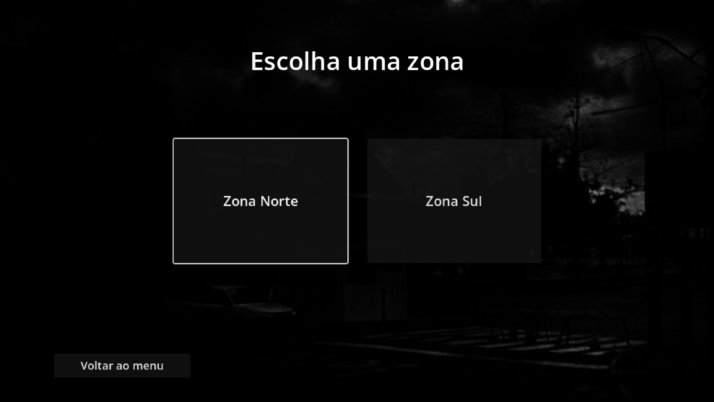
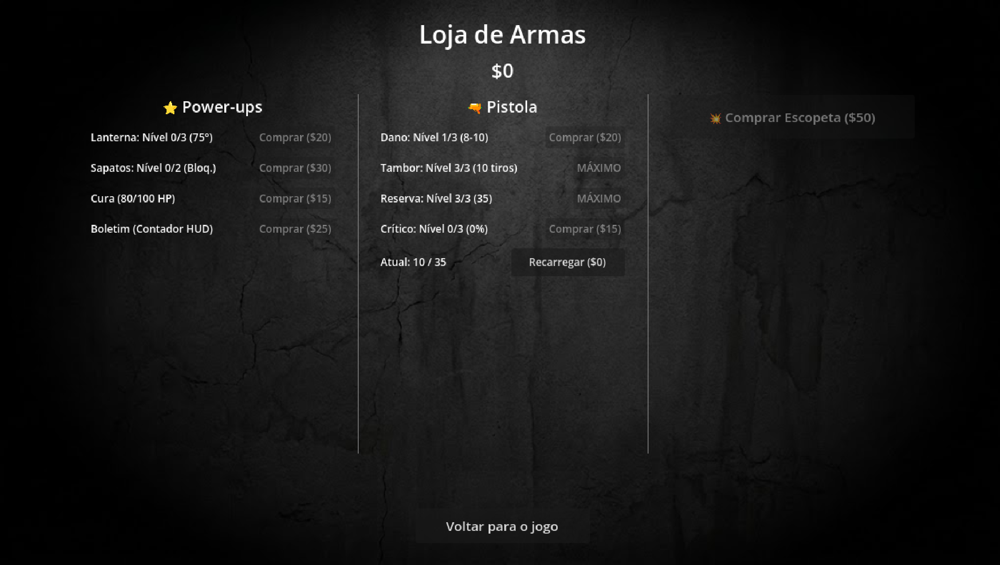
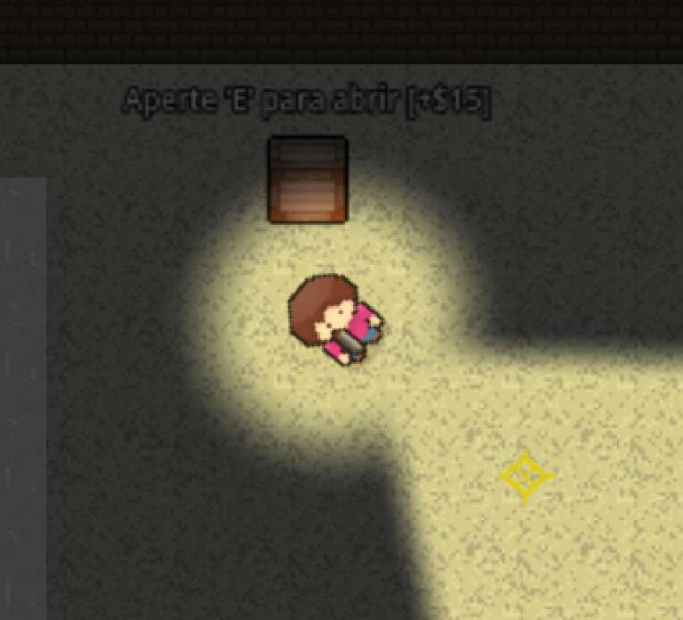
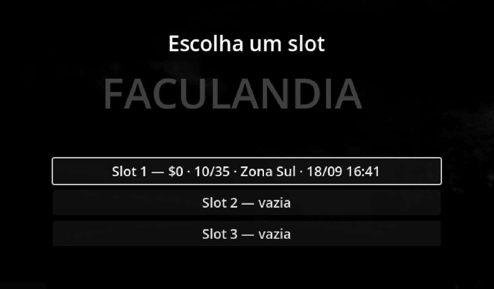

# 🏫 Faculândia

> **Top-Down Shooter & Survival Horror 2D** desenvolvido em **Godot Engine 4** (GDScript) como projeto acadêmico da **Universidade Federal do Agreste de Pernambuco (UFAPE)**.

---

## 📖 1. Contextualização, Demonstração e Equipe

### Contextualização
**Faculândia** é um jogo de tiro tático com visão aérea (*top-down shooter*) e elementos de sobrevivência (*survival horror*). Ambientado nos corredores e setores de um campus universitário sombrio e hostil tomado por criaturas hostis denominadas **Ameaças**, o jogador precisa explorar diferentes zonas acadêmicas, enfrentar ou despistar inimigos no escuro guiado por um feixe de visão cônica, gerenciar sua saúde e escassez de munição, saquear recursos caídos e retornar à **Loja** para se reabastecer e aprimorar seus equipamentos.

### Demonstração do Jogo


*Tela Inicial: Menu Principal com opções de Novo Jogo, gerenciamento de slots e carregamento de progresso.*

| Exploração e Visão Tática | Combate e Sobrevivência |
| :---: | :---: |
|  |  |
| *Feixe de visão direta cônica, percepção periférica e sombras geométricas projetadas em tempo real.* | *Confronto contra Ameaças no escuro, gerenciamento de saúde crítica e escassez de munição.* |

| Hub de Seleção de Cenários | Loja do Campus e Upgrades |
| :---: | :---: |
|  |  |
| *Seleção tática entre setores acadêmicos (Zona Norte e Zona Sul).* | *Oficina de melhorias de armas, compra da Escopeta e aquisição de power-ups.* |

| Coleta de Suprimentos | Gerenciamento de Saves |
| :---: | :---: |
|  |  |
| *Interação com caixas de recursos acadêmicos espalhadas pelo campus.* | *Painel com 4 slots de salvamento independentes e controle de versão.* |

A experiência de jogo foi estruturada em um ciclo de gameplay coeso e imersivo:

1. **Menu Principal e Gerenciamento de Saves**:
   - Tela inicial intuitiva com opções de *Novo Jogo*, *Continuar* e *Sair*.
   - Suporte a 4 slots de salvamento independentes (1 *Autosave* automático e 3 slots manuais), com confirmação de sobrescrita e indicação de data/hora e zona atual.

2. **Hub de Seleção de Cenários**:
   - Seleção de zonas do campus universitário:
     - **Zona Norte**: Setor acadêmico completo com salas de aula, corredores, móveis, obstáculos e posicionamento dinâmico de ameaças.
     - **Zona Sul**: Setor de expansão com navegação ativa e perigos distribuídos.
   - Ponto de partida tático para o jogador definir sua rota de incursão.

3. **Exploração e Combate no Campus**:
   - **Névoa de Guerra e Visão Tática**: Sistema de raycasting físico com visão direta cônica e percepção periférica. Áreas fora do campo de visão são ocluídas geometricamente, exigindo cautela a cada esquina.
   - **Acústica Interativa**: Passos e disparos emitem ondas sonoras perceptíveis pelas ameaças, incentivando o gerenciamento do ritmo de avanço.
   - **Mira e Combate**: Mira precisa com crosshair customizado, movimentação responsiva (com redução de velocidade ao andar de ré), cálculo balístico com variação de dano e disparos críticos.

4. **Coleta de Recursos e Economia**:
   - Ao abater uma ameaça, o corpo permanece no chão como vestígio e pode ser saqueado com a tecla interativa (`E`) para recolher dinheiro.
   - Caixas de suprimentos espalhadas pelos setores podem ser abertas (`E`) para obter recursos financeiros adicionais.

5. **Loja do Campus, Armas e Power-ups**:
   - Zona segura acessada ao alcançar a área de saída de cada setor.
   - Permite comprar a Escopeta e reabastecer a munição de cada arma de fogo (com indicadores de munição atual).
   - Catálogo de melhorias para Pistola (Dano, Tambor, Reserva, Crítico) e Escopeta (Dano, Tubo, Reserva, Recarga).
   - Coluna de Power-ups com abertura da Lanterna, Sapatos de Corrida (desbloqueio de Dash), Curativos e Boletim Informativo de contagem de ameaças.
   - Retorno automático ao Hub de Seleção de Cenários para a próxima incursão.

6. **HUD e Interface Informativa**:
   - Painel superior com indicador de densidade de ameaças (com contagem numérica ao adquirir o Boletim Informativo).
   - Painel inferior esquerdo com barra de saúde (`Vida Atual / Vida Máxima`), contadores de munição do pente e reserva da arma ativa, e indicadores visuais de recarga.
   - Menu de pausa completo (`ESC`) permitindo salvar o jogo a qualquer instante, reiniciar ou retornar ao menu.

---

### Equipe de Desenvolvimento
Projeto concebido e desenvolvido pelos discentes do curso de **Ciência da Computação** da **Universidade Federal do Agreste de Pernambuco (UFAPE)**:

| Integrante | GitHub / Contato |
| :--- | :--- |
| **Aline Fernanda** | [@alinesors](https://github.com/alinesors) — `aline.fernanda@ufape.edu.br` |
| **Clauderson Branco Xavier** | [@ClaudersonXavier](https://github.com/ClaudersonXavier) — `xavierclauderson98@gmail.com` |
| **Fernando Emídio** | [@fernando7492](https://github.com/fernando7492) — `emidio8000@gmail.com` |
| **Victor Alexandre Saraiva Pimentel** | [@Victor-Saraiva-P](https://github.com/Victor-Saraiva-P) — `victor.saraiva.pimentel@gmail.com` |

* **Repositório do Projeto:** [ClaudersonXavier/faculandia](https://github.com/ClaudersonXavier/faculandia)
* **Instituição:** Universidade Federal do Agreste de Pernambuco (UFAPE)

---

## ⚙️ 2. Registro de Funcionamento e Principais Características

### 🔦 Percepção Tática e Névoa de Guerra (Fog of War)
* **Raycasting Físico Multi-Camadas**: Ao contrário de sistemas de iluminação convencionais por viewport, o jogo utiliza um algoritmo proprietário de raycasting 2D integrado à física (`PhysicsDirectSpaceState2D`).
* **Três Níveis de Percepção**:
  1. *Visão Direta*: Cone frontal amplo e de longo alcance projetado a partir da mira do mouse, ocluído por paredes e obstáculos baixos (barris e caixas).
  2. *Percepção Periférica*: Raio circular curto ao redor do jogador, bloqueado apenas por paredes altas, permitindo sentir perigos imediatos pelas costas.
  3. *Fontes de Luz*: Elementos do cenário que iluminam áreas específicas independentemente da orientação do jogador.
* **Oclusão Real via Shaders**: As entidades fora do campo de percepção não são meramente escurecidas: elas sofrem descarte geométrico real (`discard`) no shader (`fragmento_perceptivel.gdshader`), impedindo informações visuais indevidas.

### 🔊 Sistema Acústico e Propagação de Som (*Noise Bus*)
* Barramento global de eventos sonoros (`noise_bus.gd`) que registra a origem, alcance e atenuação acústica de cada ação física no mundo.
* Passos geram ruídos de raio curto (~120px); impactos de balas contra obstáculos geram ruídos médios (~250px); disparos de arma de fogo geram forte reverberação (~600px).
* As ameaças reagem diretamente aos ruídos, alternando de patrulha para investigação do ponto de origem acústico.
* Áudio híbrido: efeitos sonoros reais em `.mp3` (passos, tiros e grunhidos) com suporte a sintetizador procedural dinâmico para impactos.

### 🧟 Inteligência Artificial e Variantes das Ameaças
* **Detecção Adaptativa**: Ameaças possuem campo de visão próprio. Ao obter linha de visada desobstruída (`PhysicsUtils.has_clear_line`), entram em perseguição direta ao jogador.
* **Navegação Inteligente**: Caso percam o contato visual ou precisem contornar paredes e salas, utilizam `NavigationAgent2D` para calcular rotas contornando quinas e obstáculos.
* **Separação em Bando (*Flocking*)**: Algoritmo de dispersão mútua (`flocking_utils.gd`) que evita sobreposição não natural de inimigos durante investidas em grupo.
* **Variantes de Inimigos**:
  - *Ameaça Padrão*: Inimigo equilibrado (velocidade 70 px/s, 8.0 de dano por segundo e 24.0 de vida).
  - *Ameaça Rápida* (`AmeacaRapida`): Inimigo ágil com spritesheet dedicado (velocidade 110 px/s, 4.0 de dano de contato e 16.0 de vida), compondo 25% da população de cada zona.

### 🔫 Armamento, Balística, Power-ups e Loja
* **Arsenal e Troca de Armas**:
  - *Pistola*: Arma inicial precisa, com disparo semi-automático e recarga por pente.
  - *Escopeta* (`Shotgun`): Arma comprável na loja que dispara 6 bagos em cone de dispersão lateral com knockback de impacto e recarga incremental cartucho por cartucho.
  - *Troca Rápida*: Teclas <kbd>1</kbd> e <kbd>2</kbd> com transição de 350ms e trava para armas não adquiridas.
* **Balística Precisa**: Projéteis físicos instanciados com direção, velocidade uniforme, tempo de vida e cálculo de ricochete/impacto sonoro.
* **Oficina de Melhorias e Power-ups**:
  - *Upgrades de Pistola*: Dano, Capacidade do Tambor, Munição Reserva e Chance de Crítico.
  - *Upgrades de Escopeta*: Dano por bago, Tubo de Cartuchos, Reserva Total e Velocidade de Recarga.
  - *Power-ups Gerais*: Abertura do cone de luz da Lanterna, Sapatos de Corrida (ação de Dash), Curativos consumíveis e Boletim Informativo (contador numérico no HUD).

### 💾 Persistência de Estado e Snapshot de Cenários
* **Slots de Salvamento Independentes**: 4 slots no formato `ConfigFile` com metadados versionados (envelope seguro contra corrupção).
* **Autosave Integrado**: Salvamento automático executado em todas as transições críticas de fase e retorno da loja.
* **Snapshot Vivo das Zonas**: A população de ameaças e o estado das caixas de suprimentos em cada cenário são persistidos em memória e disco. Ao retornar a uma zona anteriormente explorada:
  - Ameaças abatidas continuam mortas.
  - Corpos não saqueados e caixas não coletadas permanecem na exata posição.
  - Corpos e caixas já saqueados não reaparecem.
  - Ameaças vivas que ficaram próximas à porta de entrada são reposicionadas para uma distância segura, prevenindo emboscadas imediatas no carregamento.
* **Game Over com Recuperação Justa**: Ao zerar a vida, a tela de Game Over carrega o checkpoint mais recente sem persistir o estado de derrota, garantindo que o progresso do jogador não seja corrompido.

---

## 🎮 3. Controles de Jogabilidade

| Ação | Tecla / Entrada | Descrição |
| :--- | :--- | :--- |
| **Movimentação** | <kbd>W</kbd>, <kbd>A</kbd>, <kbd>S</kbd>, <kbd>D</kbd> ou <kbd>Setas</kbd> / Gamepad | Move o personagem pelo cenário. Andar para trás (*backpedal*) aplica penalidade de 15% na velocidade. |
| **Mirar** | `Movimento do Mouse` | Aponta a arma e orienta o cone de visão direta para o cursor. |
| **Atirar** | `Botão Esquerdo do Mouse` | Efetua disparos com a arma equipada, consumindo munição e emitindo som audível. |
| **Recarregar** | <kbd>R</kbd> | Recarrega a arma ativa com munição disponível na reserva. |
| **Trocar de Arma** | <kbd>1</kbd> / <kbd>2</kbd> | Alterna entre a Pistola (<kbd>1</kbd>) e a Escopeta (<kbd>2</kbd>, se adquirida). |
| **Dash / Investida** | <kbd>Shift</kbd> | Arranco direcional de velocidade com breve invulnerabilidade (requer Sapatos de Corrida). |
| **Interagir / Saquear** | <kbd>E</kbd> | Saqueia corpos de ameaças caídas e abre caixas de suprimentos para recolher dinheiro. |
| **Menu de Pause** | <kbd>ESC</kbd> | Pausa o jogo, permitindo salvar no slot em uso, voltar ao menu ou sair da aplicação. |

---

## 🗂️ 4. Código-Fonte, Assets, Documentação e Créditos

### Estrutura do Código-Fonte e Documentação
O projeto adota uma arquitetura modular acompanhada de documentação completa de Game Design:

* 📄 **[Game Design Document (GDD) Completo](GDD.md)**: Especificação integral de mecânicas, regras, universo, armas, balanceamento numérico e arquitetura técnica.

```text
faculandia/
├── project.godot                  # Configurações do projeto e mapeamento de inputs
├── Makefile                       # Automação de compilação, testes e execução
├── GDD.md                         # Game Design Document (GDD Final) da disciplina
├── scenes/
│   ├── world/                     # Cenas principais (Menu, Hub, Zonas, Loja)
│   ├── objects/                   # Atores e objetos interativos (Player, Ameaça, Caixas)
│   └── ui/                        # Camadas de interface (HUD, Pause, Game Over, Saves)
├── scripts/
│   ├── core/                      # Utilitários compartilhados (física, flocking, slots de save)
│   ├── player/                    # Movimentação do jogador, mira, dash e visão tática
│   ├── weapons/                   # Sistema base de armas, pistola, escopeta, projéteis e upgrades
│   ├── enemies/                   # IA, navegação, ataques e variantes das ameaças
│   ├── noise/                     # Barramento de ruído, sintetizador e reprodutor SFX
│   ├── world/                     # Gerenciamento de fases, HUD, loja, power-ups, caixas e sync de zonas
│   └── tests/                     # 15 suites de testes automatizados headless
├── shaders/                       # Shaders GLSL de visão cônica e descarte de visibilidade
├── resources/                     # Texturas, spritesheets, tilesets e áudios do jogo
└── docs/                          # ADRs, glossário e capturas de tela (screenshots/)
```

### Créditos e Atribuições de Recursos
* **Engine**: [Godot Engine 4](https://godotengine.org/) (Licença MIT).
* **Desenvolvimento e Código**: Discentes da UFAPE (Aline Fernanda, Clauderson Branco Xavier, Fernando Emídio, Victor Alexandre Saraiva Pimentel).
* **Sprites e Tilesets**:
  - Tilesets de ambientes acadêmicos e pós-apocalípticos baseados em recursos livres e modificados a partir de coleções *Liberated Pixel Cup (LPC)* e artistas da comunidade *OpenGameArt* / *itch.io*.
  - Sprites de personagens, armas e interface desenhadas e integradas especificamente para o projeto.
* **Áudio e Efeitos Sonoros**:
  - Efeitos sonoros reais de disparos, passos e reações de zumbis obtidos de bibliotecas de domínio público (*Creative Commons 0*).
  - Módulos de síntese sonora em tempo real via GDScript puro para feedback de impactos balísticos.

---

## 🚀 5. Instruções para Execução

### Pré-requisitos
* **Godot Engine 4.x** (versão recomendada: **4.2** ou superior / compatível com **Godot 4.7**).
* **Make** (opcional, mas recomendado no Linux/macOS).

### Execução Rápida via Makefile

1. **Iniciar o Jogo:**
   ```bash
   make run
   ```

2. **Executar com Placa de Vídeo Dedicada (NVIDIA Optimus / PRIME):**
   ```bash
   make run-nvidia
   ```

3. **Abrir o Projeto no Godot Editor:**
   ```bash
   make editor
   ```

4. **Executar a Bateria Completa de Testes Automatizados:**
   ```bash
   make test
   ```

5. **Configurar ou Reparar Cache de Classes e Assets:**
   ```bash
   make setup
   ```

### Executando Manualmente via Terminal

Caso o binário do Godot não esteja nomeado como `godot` no seu `PATH`, informe o caminho diretamente:

```bash
make run GODOT=/caminho/para/seu/godot
```

Ou execute o comando nativo do Godot a partir da raiz do repositório:

```bash
godot --path .
```
